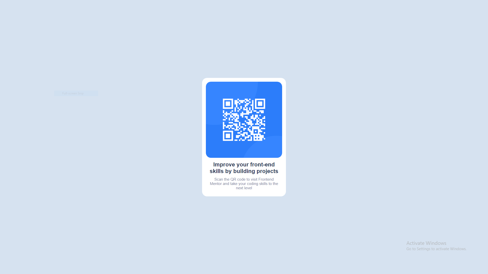
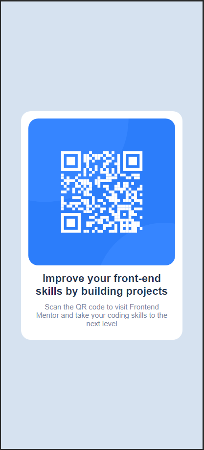

# Frontend Mentor - QR code component solution

This is a solution to the [QR code component challenge on Frontend Mentor](https://www.frontendmentor.io/challenges/qr-code-component-iux_sIO_H). Frontend Mentor challenges help you improve your coding skills by building realistic projects.

## Table of contents

- [Overview](#overview)
  - [Screenshot](#screenshot)
  - [Links](#links)
- [My process](#my-process)
  - [Built with](#built-with)
  - [What I learned](#what-i-learned)
- [Author](#author)

## Overview

### Screenshot





### Links

- Solution URL: [https://github.com/xitsjacob/QR-code-component](https://github.com/xitsjacob/QR-code-component)
- Live Site URL: [https://famous-cat-861fe6.netlify.app/](https://famous-cat-861fe6.netlify.app/)

## My process

### Built with

- Semantic HTML5 markup
- CSS custom properties
- Flexbox

### What I learned

Use this section to recap over some of your major learnings while working through this project. Writing these out and providing code samples of areas you want to highlight is a great way to reinforce your own knowledge.

Throughout this challenge I was able to learn a few new things. The two most important and noteable things I learned where how to add a Favicon, and how to center a div in the center of a screen using "vh".

To see my learnt methods code snippets, see below:

```html
<link
  rel="icon"
  type="image/png"
  sizes="32x32"
  href="./images/favicon-32x32.png"
/>
```

```css
.wrapper {
  display: flex;
  justify-content: center;
  align-items: center;
  min-height: 100vh;
}
```

## Author

- Website - [https://xitsjacob.netlify.app/](https://xitsjacob.netlify.app/)
- Frontend Mentor - [@xItsJacob](https://www.frontendmentor.io/profile/xitsjacob)
- Twitter - [@yourusername](https://www.twitter.com/yourusername)
